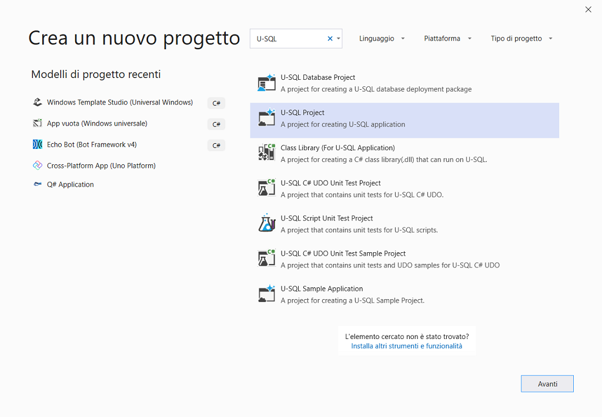
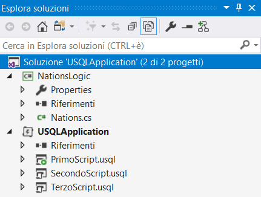
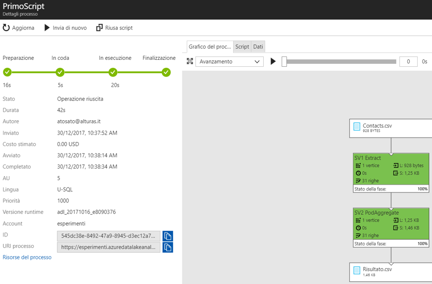
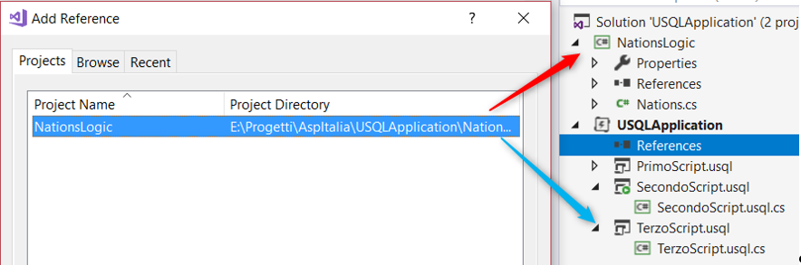
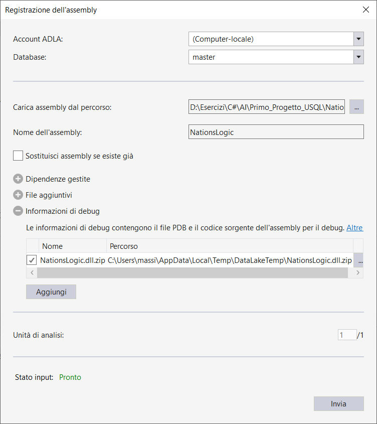
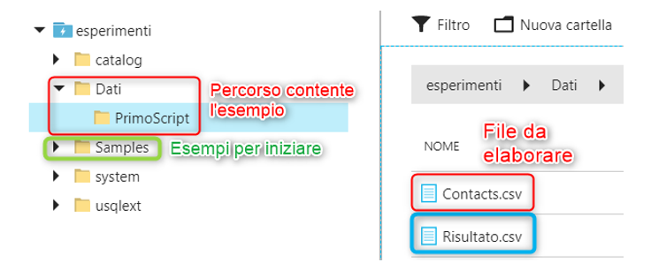

# CREAZIONE DI UN PROGETTO

Installare in **Visual Studio** un’estensione **Estensioni e aggiornamenti…** ***Strumenti Azure Data Lake e Analisi di flusso***.

Nel template è ora disponibile la voce ***Azure Data Lake*** all’interno della quale sono presenti diverse tipologie di progetto; selezioniamo ***U-SQL***.

 


 


 

File PRIMOSCRIPT.USQL

Oltre a leggere e a scrivere, si crea una minima logica di manipolazione del dato.

La sintassi utilizzata per lo script è una *SELECT* SQL in cui, dopo aver letto i dati da un file, andiamo a scriverne un secondo e con l’aggiunta della colonna *Annata*.

```sql
@elenco =  
    EXTRACT Numero int,
            Nazionalita string,
            Ruolo string,
            Nome string
    FROM "/Dati/PrimoScript/Contacts.csv"
    USING Extractors.Csv(skipFirstNRows: 1);
@Final = SELECT *, "2017-2018" AS Annata FROM @elenco;
OUTPUT @Final
TO "/Dati/PrimoScript/Risultato.csv" 
USING Outputters.Csv();
```

Eseguendo il primo script dal portale di Azure, all’interno del servizio Azure Data Lake, si può monitorare il grafico che presenta il piano di esecuzione e le varie fasi dell’esecuzione del job eseguito.

Nell’immagine seguente sono mostrati i passaggi che il motore U-SQL esegue durante l’elaborazione dello script appena riportato.

 

File NATIONS.CS

Consente di definire se il calciatore in oggetto è di nazionalità europea.

La logica è implementata in un file CS che a tutti gli effetti rappresenta il code-behind dello script U-SQL.

```csharp
using System.Collections.Generic;
using System.Linq;

namespace NationsLogic
{
    public static class Nations
    {
        private static IEnumerable<string> EuroNations = new[] { "Italia", "Slovacchia", "Albania", "Francia", "Liechtenstein" };

        public static bool IsEuropean(string nation)
        {
            if (EuroNations.Contains(nation))
                return true;
            return false;
        }
    }
}
```

La sua applicazione all’interno dello script è la seguente.

 

File SECONDOSCRIPT.USQL

```sql
@elenco =  
    EXTRACT Numero int,
            Nazionalita string,
            Ruolo string,
            Nome string
    FROM "/Dati/PrimoScript/Contacts.csv"
    USING Extractors.Csv(skipFirstNRows: 1);
@Final = SELECT *, 
                "2017-2018" AS Annata,
                USQLApplication.Nations.IsEuropean(Nazionalita) AS Europeo
         FROM @elenco;
OUTPUT @Final
TO "/Dati/PrimoScript/RisultatoNazionalita.csv" 
USING Outputters.Csv();
```

Si può utilizzare il codice C# nelle espressioni *SELECT* del linguaggio SQL o funzioni custom; il linguaggio ci consente di utilizzare la sintassi C# in molti altri punti dello script.

L’utilizzo della sintassi C# può essere sfruttato in quattro tipologie differenti.

1. **C# expressions** (in *SELECT* expressions): si possono richiamare segmenti di codice C# all’interno dell’espressione di *SELECT*. Ad esempio convertire la data odierna in una stringa formattata. Si potrebbe utilizzare quindi la sintassi C# anziché utilizzare il linguaggio SQL. Un esempio potrebbe essere: `DateTime.Now.ToString(&quot;M/d/yyyy&quot;)`.

2. **User-defined functions** (UDFs): si possono richiamare segmenti di codice C# come visto in precedenza con la funzione `IsEuropean`.

3. **User-defined aggregates** (UDAGGs): le aggregazioni definite dall’utente sono funzioni correlate all’aggregazione che non sono già incluse in U-SQL. Può trattarsi ad esempio di una funzione di aggregazione per eseguire calcoli matematici personalizzati, concatenazioni di stringa o modifiche con stringhe e così via.

4. **User-defined operators** (UDOs): sono oggetti di programmabilità personalizzati dall’utente, un esempio di UDOs è la possibilità di creare degli Extractors personalizzati per i file XML. Rientrano nella categoria UDOs tutte le classi che implementano delle logiche personalizzate per gli operatori: Outputter, Extractors, Process, Combine e Reduce.

**Registrazione di progetti esterni**

Per creare un progetto riutilizzabile è necessario creare una soluzione contenente il progetto ***Libreria di classi*** all’interno del quale creare le classi riutilizzabili.

Spostare la logica della classe *Nations* nella libreria di classi appena creata.

La libreria ***NationsLogic*** contiene la sola classe *Nations*; in seguito nell’app U-SQL referenziarla e  utilizzarla all’interno del progetto.

 

File TERZOSCRIPT.USQl

Con questo script, si utilizzano le logiche residenti nella libreria esterna, in aggiunta si generano due file distinti, uno per i calciatori europei e l’altro per gli extra-comunitari.

La prima istruzione va a referenziare l’assembly registrato in precedenza con Visual Studio; questa istruzione consente di utilizzare, nello script, la funzione `IsEuropean`.

Infine nello script sono processate due variabili contenenti dati diversi e in seguito persistiti in due file di output.

La prima istruzione va a referenziare l’assembly registrato in precedenza con Visual Studio; questa istruzione consente di utilizzare, nello script, la funzione `IsEuropean`.

Infine nello script sono processate due variabili contenenti dati diversi e in seguito persistiti in due file di output.

```sql
REFERENCE ASSEMBLY NationsLogic;
@elenco =  
    EXTRACT Numero int,
            Nazionalita string,
            Ruolo string,
            Nome string
    FROM "/Dati/PrimoScript/Contacts.csv"
    USING Extractors.Csv(skipFirstNRows: 1);
@FinalUE = SELECT *, 
                "2017-2018" AS Annata               
         FROM @elenco
         WHERE NationsLogic.Nations.IsEuropean(Nazionalita);
@FinalNonUE = SELECT *, 
                "2017-2018" AS Annata               
         FROM @elenco
         WHERE !NationsLogic.Nations.IsEuropean(Nazionalita);
OUTPUT @FinalUE
TO "/Dati/PrimoScript/RisultatoUE.csv" 
USING Outputters.Csv();
OUTPUT @FinalNonUE
TO "/Dati/PrimoScript/RisultatoNonUE.csv" 
USING Outputters.Csv();
```

 

Nell’app U-SQL è stato referenziata la libreria ***NationsLogic*** ma non è sufficiente. Con il lancio dello script capita un errore insolito che segnala che la libreria non è presente nell’app.

Il problema si verifica perché è necessario registrare la libreria all’interno del sistema Azure Data Lake.

Fare clic con il tasto destro del mouse sul progetto libreria `NationsLogic` e selezionare ***Registra Assembly***, si apre la finestra in cui ci sono indicati diverse opzioni per la registrazione.

In questo caso si sta registrando la DLL all’interno dell’istanza SQL del servizio Azure Data Lake che lancerà lo script in esecuzione.

Non ci sorprenderà quindi la richiesta dell’account Azure Data Lake e del DB nel quale registrare il codice compilato.

Registrando la DLL nel DB “master”, si hanno a disposizione i nuovi metodi in tutti i progetti.

 

Una volta selezionato il percorso della libreria da registrare, è possibile utilizzare il sorgente all’interno dell’app U-SQL.

Oltre alla registrazione da Visual Studio, è possibile registrare la libreria a run-time a partire dal percorso fisico di un file presente sul filesystem oppure da un array di byte.

Inoltre possono essere referenziate sia librerie personalizzate sia librerie presenti all’interno del framework .NET che utilizziamo usualmente nei nostri progetti.

Per utilizzare `System.XML` è necessario eseguire il seguente comando.

```xml
REFERENCE SYSTEM ASSEMBLY [System.XML];
```


## FILESYSTEM LOCALE E AZURE

Con Visual Studio e l’estensione per Azure Data Lake, si possono creare e debuggare progetti di tipo U-SQL.

Con il servizio Azure Data Lake e in particolare il servizio correlato, Azure Data Store, si possono archiviare e processare i file.

Azure Data Store sfrutta la tecnologia **WebHDFS** che consente l’accesso ai file sfruttando un FileSystem URI e solo per Azure è disponibile **AzureDataLakeFilesystem** che consente di accedere ai file con il protoccolo (*adl://*).

Con il primo script, si è elaborato il file *CONTACTS.CSV* presente nel percorso  */DATI/PRIMOSCRIPT/CONTACTS.CSV*.

 

 

Per debuggare i progetti U-SQL in locale è necessario posizionare i file in una cartella particolare del **SO** (*Sistema Operativo*) nel quale Visual Studio farà puntare la directory radice per l’esecuzione degli script.

Il percorso è il seguente.

 C:\USERS\{NOME UTENTE}\APPDATA\LOCAL\USQLDATAROOT\


