# Bot Framework


## Adaptive dialog

La conversazione può essere aggiornata in base a modifiche del contesto, piuttosto che ad eventi specifici.
Richiede Bot Framework V4 **SDK** (*Software Development Kit*) .
Supporta dialoghi waterfall, prompt e "component" per scenari custom.

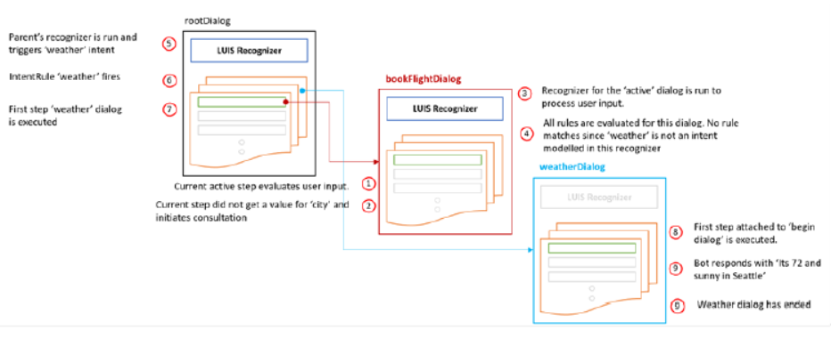


## Skill

Rappresentano una libreria di componenti riutilizzabili per il bot.

Possono includere modelli di **LUIS** (*Language Understanding Intelligent Service*), adaptive dialog e altro codice.

Sono considerati Bot Framework  Bot.

Supportano C# e TypeScript.


Già disponibili skill per calendario, email, gestione dei task, **POI** (*Point Of Interest*), automotive, meteo e news.

[Open source](https://github.com/microsoft/botframeworksolutions/
blob/master/docs/readme.md#skills-1)


# Creare un bot con Bot Framework SDK C# in Visual Studio

In questa esercitazione per C# si userà Visual Studio per creare ed eseguire un bot con il modello C# e testarlo con Bot Framework Emulator.

Se Visual Studio non è ancora installato, accedere alla pagina [Download di Visual Studio](https://visualstudio.microsoft.com/downloads/?utm_medium=microsoft&utm_source=docs.microsoft.com&utm_campaign=inline+link&utm_content=download+vs2019) per installarlo gratuitamente.


## Prerequisiti

[.NET Core SDK](https://dotnet.microsoft.com/download) version 2.1.

```bash
# determinare la versione dotnet
C:\Users\massi>dotnet --version
3.0.100-preview7-012821
```

Installare il [Modello di Bot Framework SDK v4 per C#](https://aka.ms/bot-vsix).

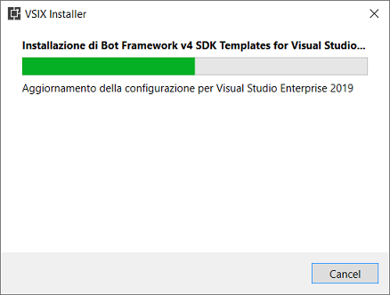

Installare il  [Bot Framework Emulator](https://github.com/Microsoft/BotFramework-Emulator/releases) che  consente d’interagire con il bot durante la fase di sviluppo, debug e testing.

 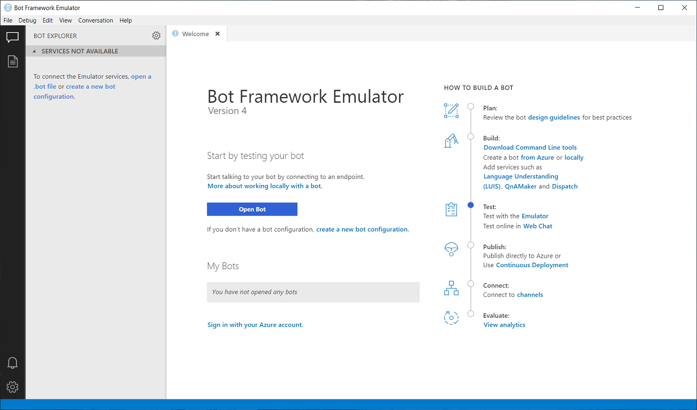


## Creare un progetto

In Visual Studio fare clic su ***Estensioni/Gestisci le estensioni***.

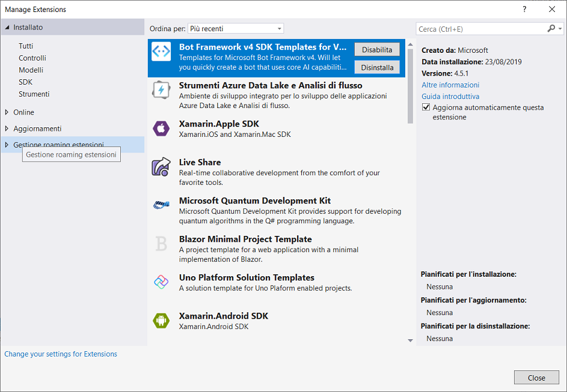

Per prima cosa, si creerà un progetto bot. Il tipo di progetto include fin dall'inizio tutti i file modello necessari.

1. Aprire Visual Studio 2019.
2. Nella finestra iniziale scegliere ***Crea un nuovo progetto***.
3. Nella finestra ***Crea un nuovo progetto*** immettere o digitare *Bot* nella casella di ricerca. 

Quindi scegliere ***Avanti***.

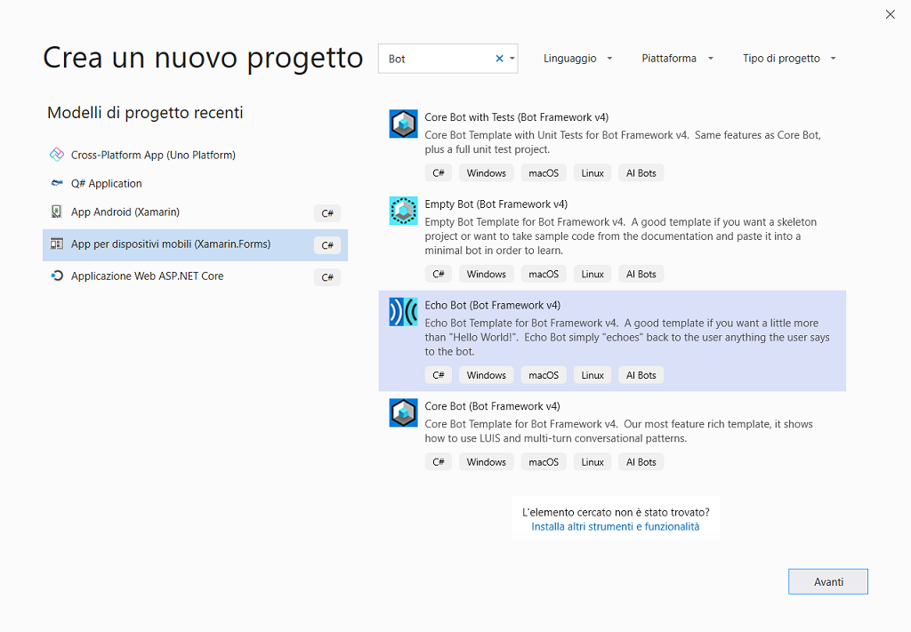

Nella finestra ***Configura il nuovo progetto*** digitare o immettere *Primo_Progetto_Bot* nella casella ***Nome del progetto***. Scegliere ***Crea***.

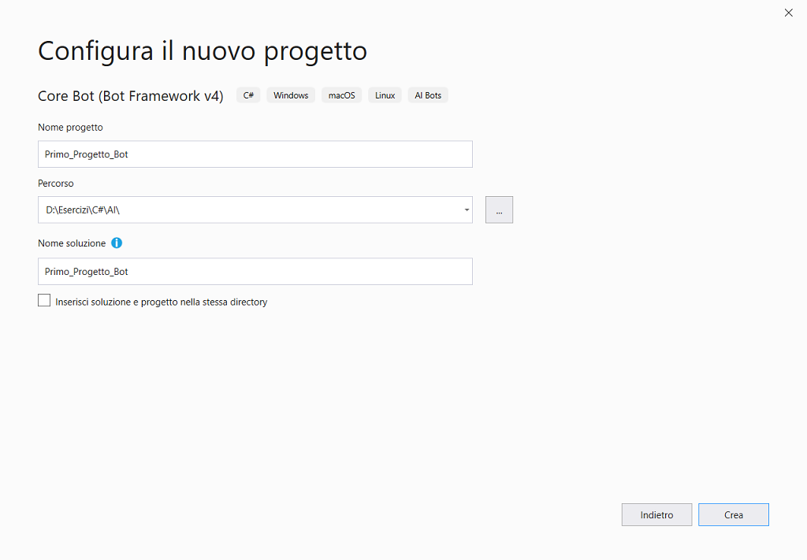

Questo bot è stato creato usando [Bot Framework](https://dev.botframework.com), è illustrato come creare un bot semplice che accetta l'input dell'utente e lo esegue nuovamente.


## Creare l'app

Il template che è basato su WebAPI di ASP.NET, crea la seguente soluzione.

È un bot già operativo, in pratica un echo bot che riceve un testo e risponde.

In ***Esplora soluzioni*** espandere la cartelle.

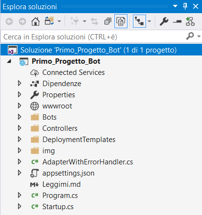

Se necessario, modificare il tipo di compilazione del progetto e impostarlo su `.Net Core 2.1`. Se necessario, aggiornare anche i `Microsoft.Bot.Builder` [pacchetti NuGet](https://docs.microsoft.com/nuget/quickstart/install-and-use-a-package-in-visual-studio).


## Esecuzione dell'app da Windows Terminal

Aprire l'app ***Windows Terminal***  e posizionarsi sulla cartella *Primo_Progetto_Bot*.

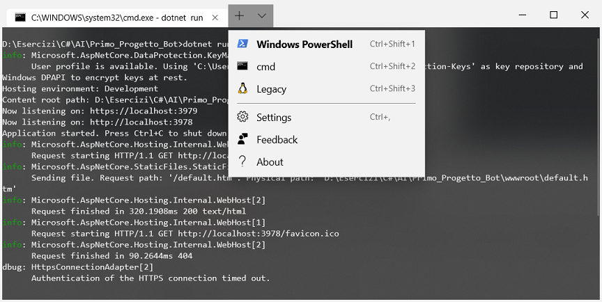


## Esecuzione dell'app da Visual Studio

A questo punto è possibile compilare, distribuire e avviare il bot in locale con l’emulatore o pubblicarlo su Azure. 

1. Fare clic su ***IIS Express*** come destinazione di debug.
2. Seleziona ***Web browser (Microsoft Edge Canary)***.
3. Assicurarsi che il ***Debug degli script (disabilitato)***.
4. Fare clic su ***Debug/Avvia senza eseguire debug (CTRL+F5)***.

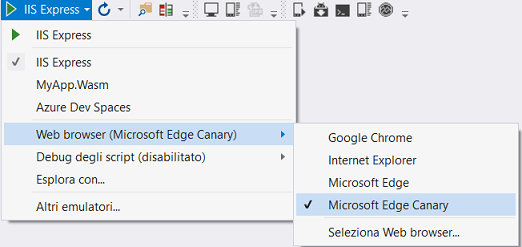

Visual Studio compilerà l'app, la distribuirà in localhost e quindi avvierà Microsoft Edge Canary per visualizzare la pagina `default.htm` dell'app. A questo punto, il bot è in esecuzione in locale.

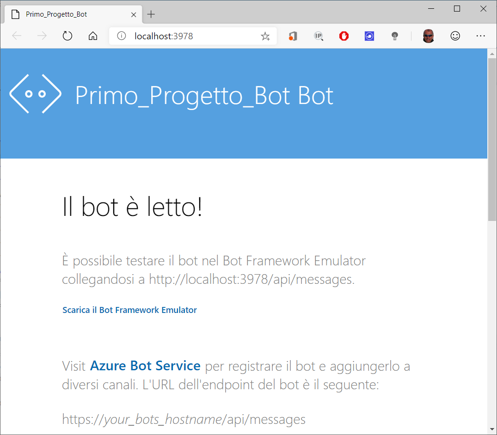

 

## Test del bot con Bot Framework Emulator

Connettersi al bot usando Bot Framework Emulator

1. Eseguire l'app ***Bot Framework Emulator (V4***).
2. Fare clic ***File/Open Bot*** .
3. Compilare il campo ***Open a bot***. Usare l'indirizzo della pagina iniziale del bot (in genere http://localhost:3978) e aggiungere le informazioni di routing '/api/messages' a tale indirizzo.
4. Fare clic su ***Connect*** .

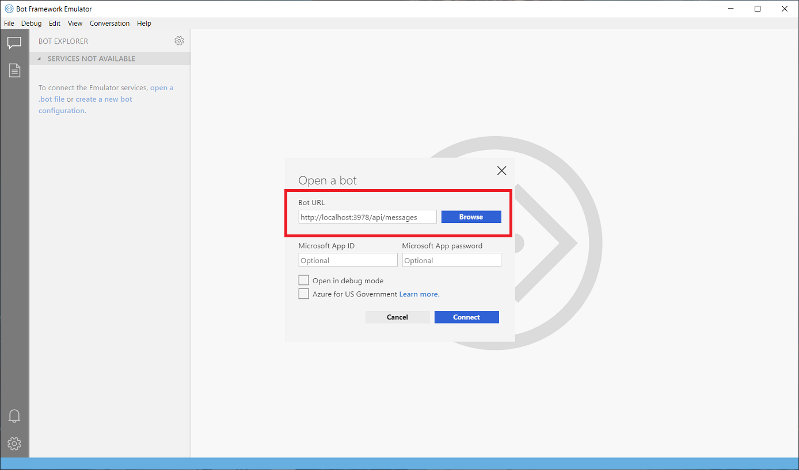


## Interagire con il bot

Fatto questo si può eseguire il bot in locale con l’emulatore o pubblicarlo su Azure.

Inviare un messaggio al bot, che risponderà con un altro messaggio.

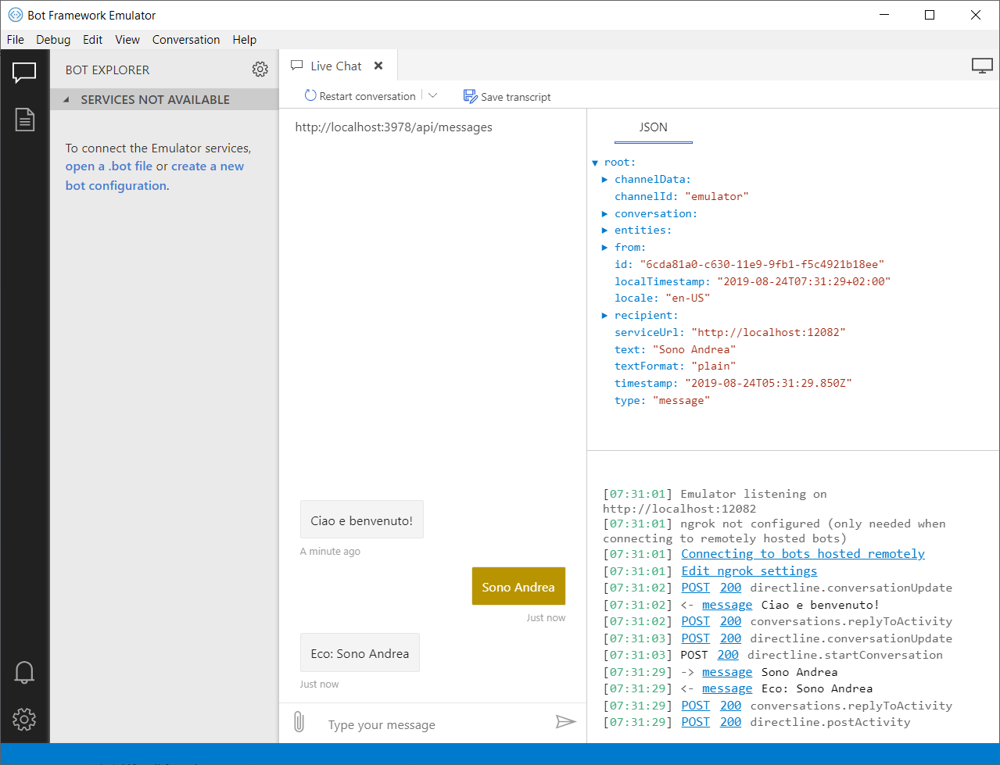

Se non è possibile inviare il messaggio, potrebbe essere necessario riavviare il PC, in quanto NGROK  non ha ancora ottenuto i privilegi necessari nel sistema. È sufficiente eseguire questa procedura una volta sola.

***NGROK***

Scaricabile all’indirizzo [seguente]([**https://ngrok.com/download/**](https://ngrok.com/download/)), le istruzioni su come utilizzarlo si trovano alla pagina [seguente](https://download.botframework.com/bf-v3/tools/emulator/publish.htm/).

Questo tool crea degli indirizzi IP virtuali, compreso HTTPS dirottando il traffico sul PC locale. La registrazione di una nuova app sul **ARP** (*Application Registration Portal*) è necessaria per l’assegnazione di token identificativi del Bot.


## Aggiungere l’intelligenza al bot

 Cognitive services.

 Sito per progettare [bot](https://www.onsequel.com/).

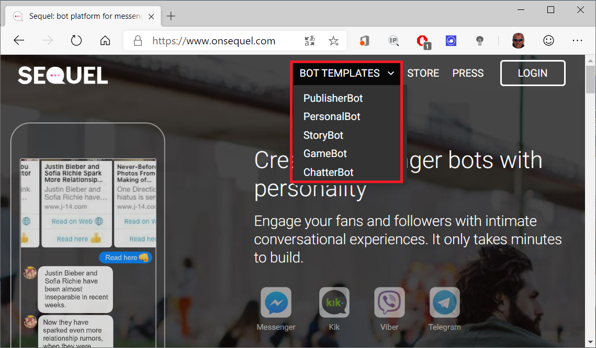


## Distribuire il bot in Azure

Per altre informazioni sulla distribuzione di un bot in Azure, vedere [Distribuire il bot in Azure](https://aka.ms/azuredeployment) per un elenco completo delle istruzioni di distribuzione.


## Ulteriori letture

- [Bot Framework Documentation](https://docs.botframework.com)
- [Bot Basics](https://docs.microsoft.com/azure/bot-service/bot-builder-basics?view=azure-bot-service-4.0)
- [Activity processing](https://docs.microsoft.com/en-us/azure/bot-service/bot-builder-concept-activity-processing?view=azure-bot-service-4.0)
- [Azure Bot Service Introduction](https://docs.microsoft.com/azure/bot-service/bot-service-overview-introduction?view=azure-bot-service-4.0)
- [Azure Bot Service Documentation](https://docs.microsoft.com/azure/bot-service/?view=azure-bot-service-4.0)
- [.NET Core CLI tools](https://docs.microsoft.com/en-us/dotnet/core/tools/?tabs=netcore2x)
- [Azure CLI](https://docs.microsoft.com/cli/azure/?view=azure-cli-latest)
- [Azure Portal](https://portal.azure.com)
- [Language Understanding using LUIS](https://docs.microsoft.com/en-us/azure/cognitive-services/luis/)
- [Channels and Bot Connector Service](https://docs.microsoft.com/en-us/azure/bot-service/bot-concepts?view=azure-bot-service-4.0)


 


 


 