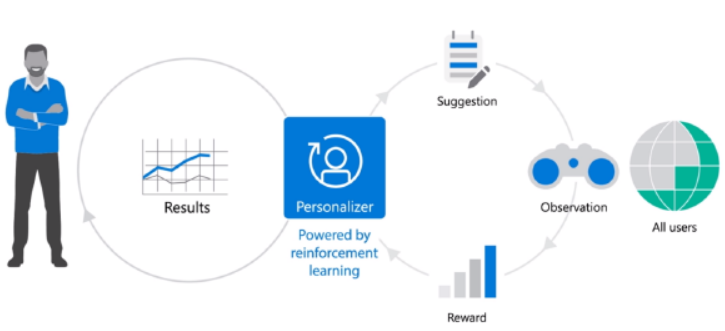

# Azure Cognitive Services

I **CS** (*Cognitive Services*) sono degli algoritmi, esposti tramite **API** (*Application Programming Interface*) che permettono di'integrare **AI** (*Artificial Intelligence*) nelle app, indipendentemente dal linguaggio scelto.
Scenari supportati:
• Decision making, speech, vision, language e search.
Servizi rilasciati in GA:
• Neural Text-to-Speech.
• Computer Vision Read.
• Text Analytics Named Entity Recognition.

### Personalizer

Crea esperienze personalizzate per ogni utente e tramite AI e offre sempre soluzioni con target mirati.
Al contrario di recommendation, cambia il set di dati, basati sulle specifiche dell’utente.

### Conversation

Trascrive in tempo reale quello che è detto durante i meeting sfruttando il «classico» speech-to-text.
Tramite Speech Service Device **SDK** (*Software Development Kit*) può essere integrato in una qualsiasi soluzione di terze parti.
Supporto nativo per Microsoft Teams.

### Form recognizer

Sfrutta algoritmi avanzati di ML per tradurre documenti e tabelle in dati riutilizzabili, applica anche il
tagging sui formati tabellari.

### Ink recognizer

Capisce forme, colori e scrittura manuale, usato di default all’interno di PowerPoint.

### Container

Pubblicati su [Docker](https://hub.docker.com/)

Speech Services.
• Speech to Text.
• Text to Speech.
Anomaly Detector.
Form Recognizer.

### Knowledge mining

Unisce le capacità d'indexing a quelle di ML per rendere le informazioni utilizzabili e significative durante le 
ricerche.
Il modello è usato da Form Recognizer.

    

Per provare gratuitamente le API CS, occorrono le [chiavi](https://azure.microsoft.com/it-it/try/cognitive-services/) .

 

 

## Creare una soluzione

File MAINPAGE.XAML

## Esecuzione dell'app

