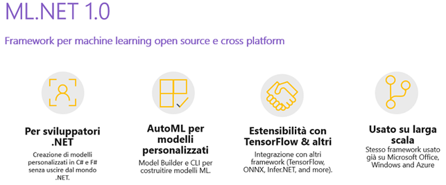
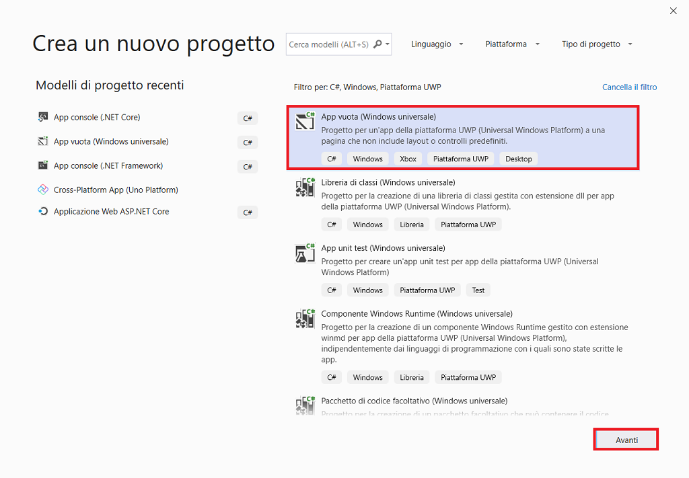
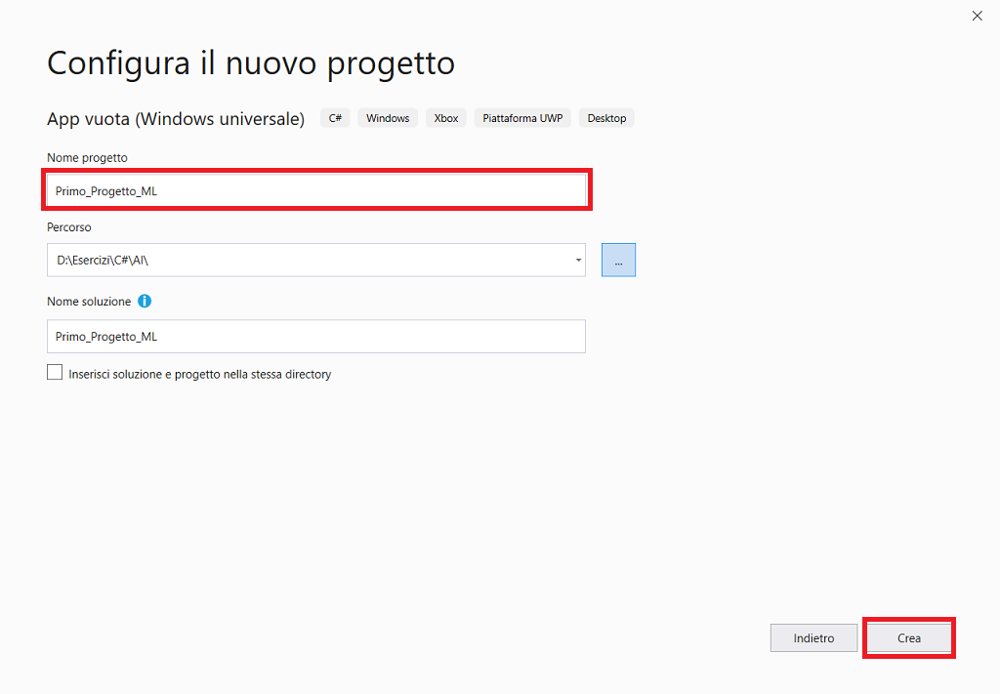
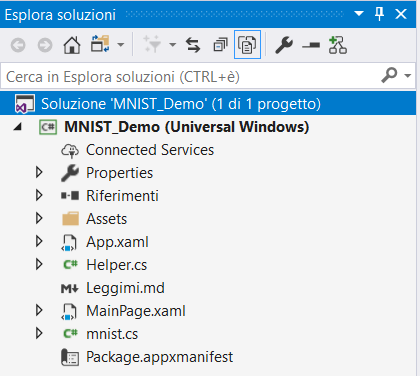
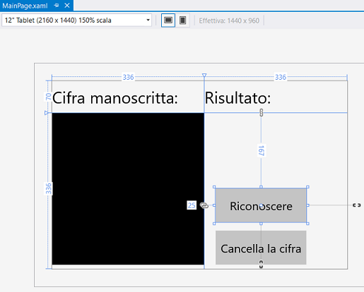
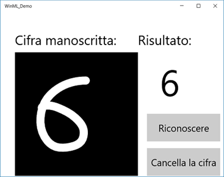

# ML.NET

È un framework open source **ML** (*Machine Learning*)  [GitHub](https://github.com/dotnet/machinelearning) di apprendimento automatico  e cross-platform (Windows, Linux, macOS) per gli sviluppatori .NET.

ML.NET offre Model Builder strumento di **UI** (*User Interface*) per Visual Studio e la **CLI** (*Command Line Interface*) con algoritmi best-performing per facilitare la costruzione di modelli ML custom utilizzando AutoML.

Utilizzando ML.NET, i programmatori possono sfruttare la loro strumenti esistenti e skillsets per sviluppare e infondere **AI** (*Artificial Intelligence*) personalizzato nelle proprie applicazioni mediante la creazione personalizzata di ML modelli per scenari comuni come immagine di Sentiment Analysis, raccomandazione e classificazione.

Permette di costruire, fare training e deployare modelli di ML personalizzati sfruttando:
• .NET Core (con supporto per Windows, Linux e macOS).
• C#, F#.
Modelli personalizzati con algoritmi best-performing creati automaticamente con AutoML e ML.NET CLI.

Per scenari «tradizionali» può essere esteso con TensorFlow, Infer.NET e ONNX.
Supporta operazioni di:
• Sentiment analysis.
• Image classification e object detection.
• Customer segmentation, sales forecasting, price prediction e product recommendation.



 [Tutorial](https://dotnet.microsoft.com/learn/machinelearning-ai/ml-dotnet-get-started-tutorial/intro/)

 [ML](https://docs.microsoft.com/it-it/dotnet/machine-learning/)

 [MLNET](https://marketplace.visualstudio.com/items?itemName=MLNET.07)

 

#  Creare un'app ML C# in Visual Studio

In questa introduzione all'**IDE** (*Integrated Development Environment)* di Visual Studio sarà creata una semplice app "MNIST_Demo" eseguibile in qualsiasi dispositivo Windows 10. A tale scopo, saranno usati un modello di progetto della piattaforma **UWP** (*Universal Windows Platform*), **XAML** (*Extensible Application Markup Language*)  e il linguaggio di programmazione C#.

Se Visual Studio non è ancora installato, accedere alla pagina [Download di Visual Studio](https://visualstudio.microsoft.com/downloads/?utm_medium=microsoft&utm_source=docs.microsoft.com&utm_campaign=inline+link&utm_content=download+vs2019) per installarlo gratuitamente.


## Creare una soluzione

Per prima cosa è necessario creare un progetto della piattaforma UWP. Il tipo di progetto include fin dall'inizio tutti i file di modello necessari.

Per prima cosa, si creerà un progetto di app C#. Il tipo di progetto include fin dall'inizio tutti i file modello necessari.

1. Aprire Visual Studio 2019.
2. Nella finestra iniziale scegliere ***Crea un nuovo progetto***.
3. Nella finestra ***Crea un nuovo progetto*** immettere o digitare *Windows universale* nella casella di ricerca. Scegliere quindi **C# **  dall'elenco ***Linguaggio*** e ***Windows*** dall'elenco ***Piattaforma***.

Dopo aver applicato i filtri di linguaggio e piattaforma, scegliere il modello ***App vuota (Windows universale)*** e quindi scegliere ***Avanti***.



 Se il modello ***App vuota (Windows universale)*** non è visualizzato, è possibile installarlo dalla finestra ***Crea un nuovo progetto***. Nel messaggio ***L'elemento cercato non è stato trovato?*** scegliere il collegamento ***Installa altri strumenti e funzionalità***.

 Scegliere quindi il carico di lavoro ***Sviluppo di app per la piattaforma UWP (Universal Windows Platform)*** nel programma d'installazione di Visual Studio.

Scegliere quindi il pulsante ***Modifica*** nel programma d'installazione di Visual Studio. Quando è richiesto, salvare il lavoro. Scegliere quindi ***Continua*** per installare il carico di lavoro. 

4. Nella finestra di dialogo ***Nuovo progetto della piattaforma UWP (Universal Windows Platform)*** accettare le impostazioni predefinite per ***Versione di destinazione***: e ***Versione minima***:.



5. Nella finestra ***Configura il nuovo progetto*** digitare o immettere *Primo_Progetto_ML* nella casella ***Nome del progetto***. Scegliere ***Crea***.

Se è la prima volta che si usa Visual Studio per creare app UWP, è possibile che sia visualizzata la finestra di dialogo ***Impostazioni***. Scegliere ***Modalità sviluppatore*** e ***S*ì**.


Visual Studio installa un pacchetto aggiuntivo di modalità sviluppatore per l'utente. Una volta completata l'installazione del pacchetto, chiudere la finestra di dialogo ***Impostazioni***.

## Creare l'app

A questo punto è possibile iniziare a sviluppare l'app. 

Riconoscere un numero digitato a schermo in un controllo *InkCanvas*, con l’ausilio di un modello già creato e convertito in ONNX a partire da Azure Machine Learning.



File MAINPAGE.XAML

Inserire un controllo `InkCanvas` e un pulsante per effettuare il riconoscimento.



File MAINPAGE.XAML.CS

Aggiungere il namespace relativo alla parte di WinML.

```csharp
using Windows.AI.MachineLearning.Preview;
```

A questo punto, l’app è pronta per ricevere il modello: MNIST.ONNX creato con il CNTK a partire dal data set [MNIST](http://yann.lecun.com/exdb/mnist/)  che comprende oltre diecimila immagini di scritture manuali e oltre sessantamila test.

####  Integrazione del modello

Caricato in Visual Studio e fatta la generazione del codice, i passaggi successivi sono principalmente divisi in tre parti.

1. Caricamento del modello.
2. Binding delle risorse d’input e di output che il modello si aspetta.
3. Valutazione del modello.

Prima di tutto vanno inizializzate le variabili che rappresentano le classi wrapper generate da Visual Studio.

```csharp
private MNISTModel ModelGen = new MNISTModel();
private MNISTModelInput ModelInput = new MNISTModelInput();
private MNISTModelOutput ModelOutput = new MNISTModelOutput();

```

Quindi sarà necessario andare a caricare il modello a partire dal file aggiunto nella cartella ASSETS del progetto tramite le **API** (*Application Programming Interface*) di `StorageFile` e quindi agganciarlo alla classe corrispondente al modello stesso creato da Visual Studio.

Le classi generate saranno tutte contenute in un file chiamato con lo stesso nome del modello, in questo caso MNIST.CS.

```csharp
private async void LoadModel()
{
  StorageFile modelFile = await StorageFile.GetFileFromApplicationUriAsync(new Uri($"ms-appx:///Assets/MNIST.onnx"));
  ModelGen = await MNISTModel.CreateMNISTModel(modelFile);
 }

```

Il metodo `CreateMNISTModel` è stato generato sempre automaticamente e tramite le API contenute in
`Windows.AI.MachineLearning`, permette di precaricare il modello con la chiamata a `LearningModelPreview.LoadModelFromStorageFileAsync`.

```csharp
private LearningModelPreview learningModel;
public static async Task<MNISTModel> CreateMNISTModel(StorageFile file)
{
  LearningModelPreview learningModel = await LearningModelPreview.LoadModelFromStorageFileAsync(file);
  MNISTModel model = new MNISTModel();
  model.learningModel = learningModel;
   return model;
}
```

La vera e propria valutazione però, avviene solamente allo scatenarsi dell’evento di `Click` sul pulsante `Recognize` creato nell’**UI** (*User Interface*).

Le operazioni da effettuare in questo caso sono due.

1. Binding delle proprietà d’input verso il modello.
2. Analisi con il recupero delle proprietà di output.

```csharp
private async void recognizeButton_Click(object sender, RoutedEventArgs e)
{
  ModelInput.Input3 = await helper.GetHandWrittenImage(inkGrid);
  ModelOutput = await ModelGen.EvaluateAsync(ModelInput);
  var maxIndex = ModelOutput.Plus214_Output_0.IndexOf(ModelOutput.Plus214_Output_0.Max());
  numberLabel.Text = maxIndex.ToString();
}
```

Quando si parla di elaborazioni d’immagini, come in questo caso in cui dev’essere riconosciuto un numero, la velocità è fondamentale, per questo motivo l’uso dei formati standard d’immagini come **PNG** (*Portable Network Graphics*) o **JPEG** (J*oint Photographic Experts Group*) non sono consigliati perché poco performanti. Microsoft ha previsto out-of-the-box un’alternativa, rappresentata dalla classe `VideoFrame` che consente di wrappare all’interno di un singolo frame di un video, una serie di dati come ad esempio un’immagine, la cui elaborazione può essere fatta in Direct3D con l’uso di hardware-acceleration tramite GPU.

Poiché la valutazione di un modello richiede tanto più tempo quanto è complesso il modello stesso, si è deciso che le variabili d’input debbano essere degli oggetti di tipo `VideoFrame`, in questo modo tutta l’analisi trarrà vantaggio e si avranno tempi di elaborazioni minori.

La funzionalità per convertire il numero, scritto all’interno dell’`InkCanvas`, ad un oggetto `VideoFrame` da impostare poi come input nella variabile `Input3` è stata scritta all’interno di una classe chiamata `Helper`.

```csharp
public async Task<VideoFrame> GetHandWrittenImage(Grid grid)
{
    RenderTargetBitmap renderBitmap = new RenderTargetBitmap();
    await renderBitmap.RenderAsync(grid);
    var buffer = await renderBitmap.GetPixelsAsync();
    var softwareBitmap = SoftwareBitmap.CreateCopyFromBuffer(buffer, BitmapPixelFormat.Bgra8, renderBitmap.PixelWidth, renderBitmap.PixelHeight, BitmapAlphaMode.Ignore);
    buffer = null;
    renderBitmap = null;
    VideoFrame vf = VideoFrame.CreateWithSoftwareBitmap(softwareBitmap);
    await CropAndDisplayInputImageAsync(vf);
    return cropped_vf;
}
```

#### Valutazione del modello

Bisogna creare un oggetto di tipo `RenderTargetBitmap` e quindi fargli eseguire il render dell’`InkCanvas` stesso per ottenere un’immagine, da passare poi al metodo `CreateWithSoftwareBitmap` che creerà una istanza di `VideoFrame`.

La valutazione del modello invece, è eseguita a partire dal modello caricato in precedenza e con a disposizione gli input appena impostati.

```csharp
public async Task<MNISTModelOutput> EvaluateAsync(MNISTModelInput input)
{
       MNISTModelOutput output = new MNISTModelOutput();
       LearningModelBindingPreview binding = new LearningModelBindingPreview(learningModel);
       binding.Bind("Input3", input.Input3);
       binding.Bind("Plus214_Output_0", output.Plus214_Output_0);
       LearningModelEvaluationResultPreview evalResult = await learningModel.EvaluateAsync(binding, string.Empty);
       return output;
}
```

Sono creati i binding per gli input e gli ouput, e, infine, è chiamato il metodo `EvaluateAsync` per fare l’analisi del modello in modalità asincrona.

Chiaramente, poiché si sta facendo l’analisi di un modello, non è detto che il risultato ottenuto sia corrispondente a quanto ci si aspetta: l’analisi, nonostante faccia uso di modelli matematici, è di tipo predittivo, pertanto è bene non dare per scontato e prendere per veritieri i risultati ottenuti.

L’accuratezza di queste analisi migliora sulla base del numero di dati, pertanto più sarà grande il training set d’informazioni, più si potrà costruire un modello preciso ma questo richiede anche l’aggiornamento costante dell’app con nuovi modelli dati.

 

## Esecuzione dell'app

 A questo punto è possibile compilare, distribuire e avviare l'app UWP "MNIST_Demo" per verificarne l'aspetto. 

1. Usare il pulsante di riproduzione (include il testo **Computer locale**) per avviare l'app nel PC locale.




